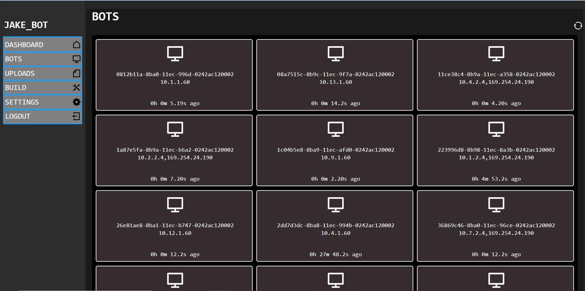

# HTTPWorker
HTTPWorker is a Flask-based HTTP(S) command and control framework with custom Windows implants (EXE and DLL) written in C++. It was designed to be simple to deploy and easily configurable for security competitions.  

### Implant Capabilities
+ command execution
+ file upload
+ file download
+ fetch system information (OS, network addresses, public IP, username, device name, memory amount, region)
+ DLL loading
+ screenshot
+ process list
+ process kill

### Server Capabilities
In addition to coordinating implant communication, the Flask webapp provides a simple and easy to use web interface for interacting with connected bots. 


The "Bots" page shows the full list of clients which have called back to the C2 - UUID, IP addresses, and the time of last checkin.  


The panel is locked behind an authentication page with user accounts. Passwords are hashed using scrypt.


# Setup
## Server
#### Prerequisites
- docker
- docker-compose

#### Quick Install
Clone repo
```
git clone https://github.com/JrM2628/httpworker.git
```
Go to server directory
```
cd httpworker/server
```
Start server
```
sudo docker-compose up
```
Create account
```
From browser: https://[C2 IP Address]:5000/signup
```

#### Containers
There are two containers in this C2 setup.
##### proxy
+ Nginx reverse proxy which directs traffic to webapp:5000
+ Exposed port: 80, 443
+ Redirects any attempt to access /signup endpoint to https://www.ritsec.club
+ Default cert.crt and key.pem are included, though they should be changed out to prevent against certificate fingerprinting

##### webapp
+ Flask server which handles C2 web application/API logic
+ Exposed ports: 5000
+ External access to this server should be restricted with a firewall rule that only allows access from a red team-controlled device  
    + This is because /signup endpoint is accessible via this server, allowing anyone to create a red team account    

#### Pwnboard
 [Pwnboard](https://github.com/micahjmartin/pwnboard) is used by RIT red teams in security competitions and engagements to track beacons in one consolidated place. To enable Pwnboard integration: 
1. Set app.pwnboard_enabled to "true" in __ init__.py
2. Set app.pwnboard_host to the hostname of the pwnboard (no scheme or URL endpoint) in __ init__.py
3. Verify IP regex in heartbeat function (bot_communication.py) is set correctly. Defaults to 10.0.0.0/8 

## Client
1. Choose whether you want EXE, DLL, or service (coming soon) implant 
2. Open desired solution file from client/windows and compile in release mode
3. Modify build.py configuration values to align with desired values
    + Hostname, port, and sleeptime almost definitely need to be changed
    + Endpoints, key, xorKey should be changed to prevent against detection but updating these values will require changing the values server-side 
4. ``` python3 build.py --v --i httpworker.exe --o out.exe```
5. (Optional) sign using self-signed cert 
    + ```.\signtool.exe sign /v /a /debug /f "path\to\signingcert.pfx" /p Password123! .\out.exe```